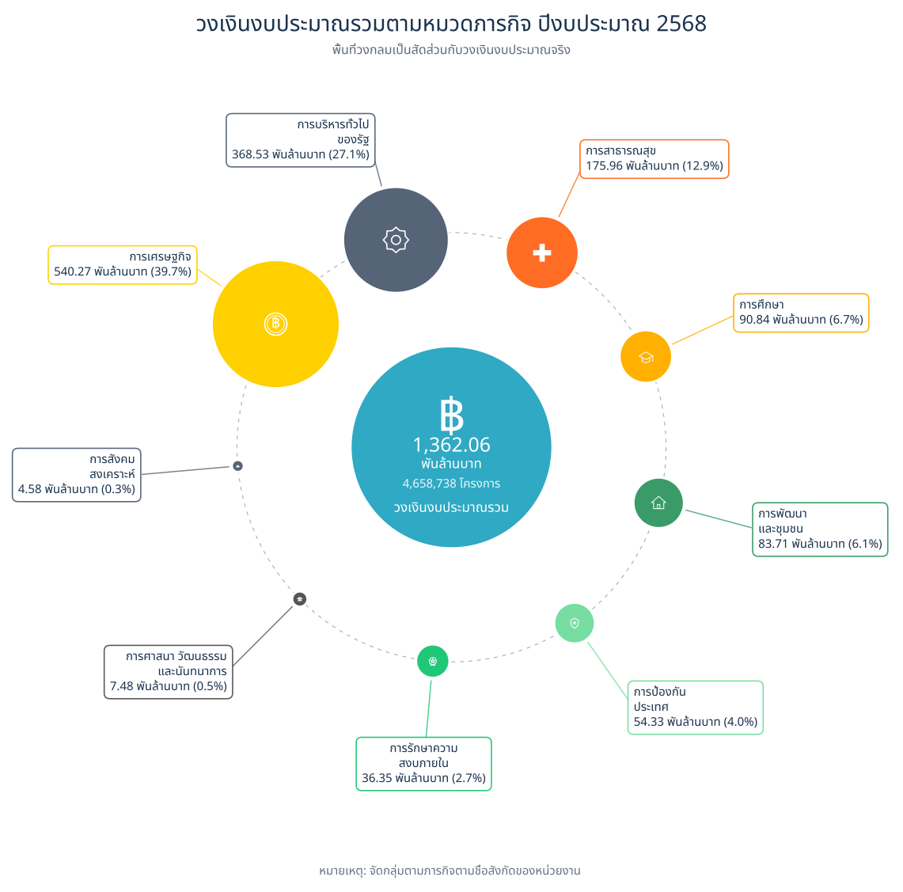
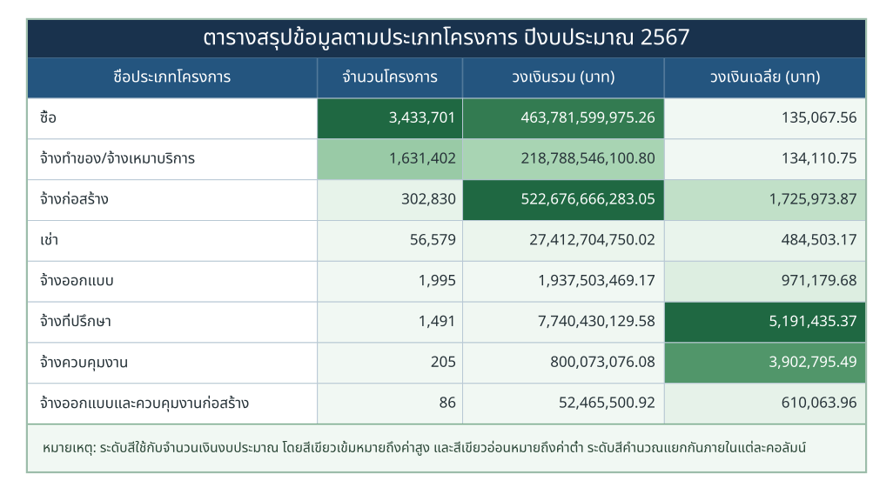
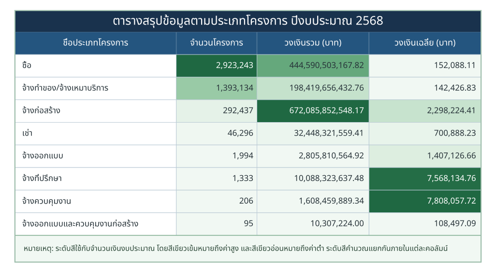

<a id="top"></a>

<div align="center">

# Exploring Thailand's Government Procurement Spending

### การสำรวจการใช้จ่ายภาครัฐไทยผ่านข้อมูลการจัดซื้อจัดจ้าง

<br>


<br>

**การสำรวจโครงสร้าง แนวโน้ม และการกระจายตัวของการจัดซื้อจัดจ้างภาครัฐไทย**  
**จากข้อมูลปีงบประมาณ พ.ศ. 2567–2569**

<br>

[Project Overview](#project-overview) ·
[Executive Summary](#executive-summary) ·
[Analysis](#contents) ·
[Data Source](#data-source)

</div>

---

<a id="project-overview"></a>

## Project Overview — ภาพรวมสัญญาจัดซื้อจัดจ้างภาครัฐ

> จากภาพรวมการใช้จ่ายภาครัฐ สู่คำถามว่าเหตุใด “งานจ้างก่อสร้าง” จึงควรถูกนำมาศึกษาต่อ

ข้อมูลการจัดซื้อจัดจ้างภาครัฐมีโครงการหลายล้านโครงการต่อปี ครอบคลุมทั้งการซื้อ การจ้างบริการ การก่อสร้าง การเช่า และงานวิชาชีพเฉพาะด้าน การเริ่มต้นวิเคราะห์จากโครงการใดโครงการหนึ่งทันทีอาจทำให้มองไม่เห็นว่าโครงการนั้นอยู่ตรงไหนในโครงสร้างการใช้จ่ายทั้งหมด ส่วนนี้จึงเริ่มจากภาพกว้างสองมิติ ได้แก่ **รัฐใช้วงเงินไปกับภารกิจด้านใด** และ **สัญญาประเภทใดเป็นตัวขับเคลื่อนจำนวนโครงการและมูลค่า** ก่อนลดขอบเขตสู่งานจ้างก่อสร้างในส่วนถัดไป

> **ขอบเขตข้อมูล:** ปีงบประมาณ 2569 เป็นข้อมูลสะสมถึงวันที่ **30 กรกฎาคม 2569** จึงยังไม่ใช่ข้อมูลเต็มปี และไม่ควรนำจำนวนโครงการหรือวงเงินไปเปรียบเทียบกับปี 2567–2568 โดยตรงโดยไม่คำนึงถึงช่วงเวลาที่ครอบคลุม

---

<a id="data-source"></a>

## Data Source

ข้อมูลหลักที่ใช้ในโครงการมาจาก

**Thailand Government Spending**  
**ระบบข้อมูลการใช้จ่ายภาครัฐ**

[https://govspending.data.go.th/](https://govspending.data.go.th/)

ขอขอบคุณหน่วยงานผู้ดูแล **ระบบข้อมูลการใช้จ่ายภาครัฐ (Thailand Government Spending)** ที่ได้รวบรวมและเผยแพร่ข้อมูลด้านการจัดซื้อจัดจ้างภาครัฐ เพื่อสนับสนุนการนำข้อมูลไปใช้ประโยชน์ในการศึกษา การวิเคราะห์ และการพัฒนางานด้านข้อมูล

ข้อมูลจากแหล่งดังกล่าวถูกนำมาผ่านกระบวนการตรวจสอบ จัดโครงสร้าง ทำความสะอาด และวิเคราะห์เพิ่มเติมเพื่อใช้ในการศึกษาครั้งนี้

**การใช้และตีความข้อมูล:** ผลการวิเคราะห์ การตีความ และการนำเสนอภายในโครงการนี้จัดทำขึ้นเพื่อวัตถุประสงค์ด้านการศึกษาและการวิเคราะห์ข้อมูล โดยเป็นผลงานของผู้จัดทำ และไม่ถือเป็นผลการวิเคราะห์หรือข้อสรุปอย่างเป็นทางการของหน่วยงานเจ้าของข้อมูล

**ที่มาของภาพและกราฟ:** [Exploring Thailand's Government Procurement Spending](https://github.com/panithan1991/Exploring-Thailand-s-Government-Procurement-Spending)

---

<a id="contents"></a>

## Contents

| Section | หัวข้อการวิเคราะห์ |
| :---: | --- |
| **01** | [ภาพรวมสัญญาจัดซื้อจัดจ้างภาครัฐ](#project-overview) |
| **01.1** | [วงเงินงบประมาณรวมจำแนกตามหมวดภารกิจ](#section-1-1) |
| **02** | [การจัดซื้อจัดจ้างจำแนกตามประเภทสัญญา](#section-2) |
| **03** | [ข้อค้นพบหลัก: เหตุใดงานก่อสร้างจึงควรถูกศึกษาต่อ](#executive-summary) |
| **04** | [เหตุใดจึงเจาะลึกปีงบประมาณ 2569](#section-4) |
| **05** | [คำถามและเส้นทางการวิเคราะห์ส่วนถัดไป](#section-5) |

---

<a id="section-1-1"></a>

## ภาพใหญ่: วงเงินกระจุกอยู่ในภารกิจใด

| ปีงบประมาณ 2567 | ปีงบประมาณ 2568 | ปีงบประมาณ 2569* |
| :---: | :---: | :---: |
| [](figures/2_2567.svg) | [](figures/2_2568.svg) | [](figures/2_2569.svg) |

<p align="center"><em>รูปที่ 1–3 วงเงินงบประมาณรวมจำแนกตามหมวดภารกิจ (คลิกที่ภาพเพื่อดูขนาดเต็ม)</em></p>

<details>
<summary><b>ดูภาพขยาย — ปีงบประมาณ 2567</b></summary>

<br>

<p align="center">
  <a href="figures/2_2567.svg">
    
  </a>
</p>

</details>

<details>
<summary><b>ดูภาพขยาย — ปีงบประมาณ 2568</b></summary>

<br>

<p align="center">
  <a href="figures/2_2568.svg">
    
  </a>
</p>

</details>

<details>
<summary><b>ดูภาพขยาย — ปีงบประมาณ 2569</b></summary>

<br>

<p align="center">
  <a href="figures/2_2569.svg">
    
  </a>
</p>

</details>

ในช่วงปีงบประมาณ 2567–2569 หมวด **การเศรษฐกิจ** มีวงเงินสูงที่สุดอย่างต่อเนื่อง คิดเป็น 33.4%, 39.7% และ 36.3% ของวงเงินรวมตามลำดับ รองลงมาคือ **การบริหารทั่วไปของรัฐ** และ **การสาธารณสุข** เมื่อรวมสามหมวดแรกจะครองวงเงินประมาณ 75–80% ของแต่ละปี สะท้อนว่าการใช้จ่ายภาครัฐมีน้ำหนักอยู่ในภารกิจหลักเพียงไม่กี่กลุ่ม

อย่างไรก็ตาม ภาพตามหมวดภารกิจยังไม่ตอบว่าเงินเหล่านี้ถูกดำเนินการผ่านสัญญาประเภทใด จึงต้องมองข้อมูลอีกชั้นหนึ่งด้วยการจำแนกตามประเภทโครงการ

> **หมายเหตุเรื่องการตีความ:** หมวดภารกิจในกราฟเป็นการจัดกลุ่มเพื่อการวิเคราะห์จากข้อมูลสังกัด ชื่อหน่วยงาน และกฎคำสำคัญ ไม่ใช่รหัสจำแนกงบประมาณอย่างเป็นทางการ

<a id="section-2"></a>

## จากภารกิจของรัฐสู่ประเภทสัญญา

| ปีงบประมาณ 2567 | ปีงบประมาณ 2568 | ปีงบประมาณ 2569* |
| :---: | :---: | :---: |
| [](figures/4_2567.svg) | [](figures/4_2568.svg) | [](figures/4_2569.svg) |

<p align="center"><em>รูปที่ 4–6 จำนวนโครงการ วงเงินรวม และวงเงินเฉลี่ย จำแนกตามประเภทโครงการ (คลิกที่ภาพเพื่อดูขนาดเต็ม)</em></p>

<details>
<summary><b>ดูภาพขยาย — ปีงบประมาณ 2567</b></summary>

<br>

<p align="center">
  <a href="figures/4_2567.svg">
    
  </a>
</p>

</details>

<details>
<summary><b>ดูภาพขยาย — ปีงบประมาณ 2568</b></summary>

<br>

<p align="center">
  <a href="figures/4_2568.svg">
    
  </a>
</p>

</details>

<details>
<summary><b>ดูภาพขยาย — ปีงบประมาณ 2569</b></summary>

<br>

<p align="center">
  <a href="figures/4_2569.svg">
    
  </a>
</p>

</details>

<a id="executive-summary"></a>

### Executive Summary

ภาพที่เห็นชัดคือ **“โครงการส่วนใหญ่” กับ “วงเงินส่วนใหญ่” ไม่ได้อยู่ในสัญญาประเภทเดียวกัน**

- โครงการประเภท **ซื้อ** มีจำนวนมากที่สุดในทุกปี อยู่ที่ประมาณ 2.47–3.43 ล้านโครงการ
- โครงการ **จ้างทำของ/จ้างเหมาบริการ** มีจำนวนมากเป็นลำดับถัดมา อยู่ที่ประมาณ 1.23–1.63 ล้านโครงการ
- **งานจ้างก่อสร้าง** มีจำนวนเพียง 178,978–302,830 โครงการ แต่มีวงเงินรวมสูงกว่าสัญญาประเภทอื่นในทุกปีที่ศึกษา

| ปีงบประมาณ | จำนวนโครงการก่อสร้าง | สัดส่วนจำนวนโครงการทั้งหมด | วงเงินก่อสร้างรวม | สัดส่วนวงเงินทั้งหมด | วงเงินเฉลี่ยต่อโครงการ |
| :---: | ---: | ---: | ---: | ---: | ---: |
| **2567** | 302,830 | 5.58% | 522.68 พันล้านบาท | 42.04% | 1.73 ล้านบาท |
| **2568** | 292,437 | 6.28% | 672.09 พันล้านบาท | 49.34% | 2.30 ล้านบาท |
| **2569*** | 178,978 | 4.55% | 475.93 พันล้านบาท | 40.57% | 2.66 ล้านบาท |

ตารางนี้ชี้ให้เห็นว่า งานก่อสร้างไม่ได้โดดเด่นเพราะมีจำนวนโครงการมากที่สุด แต่โดดเด่นเพราะ **โครงการจำนวนไม่มากเมื่อเทียบกับทั้งหมดกลับรองรับวงเงินประมาณ 40–49%** ของวงเงินจัดซื้อจัดจ้างในแต่ละปี ความหนาแน่นของมูลค่านี้ทำให้งานก่อสร้างเป็นจุดเริ่มต้นที่เหมาะสมสำหรับการวิเคราะห์เชิงลึก

<a id="section-4"></a>

## เหตุใดจึงเจาะลึกปีงบประมาณ 2569

การวิเคราะห์ส่วนถัดไปเลือกงานจ้างก่อสร้างปีงบประมาณ 2569 เป็นกรณีศึกษา ไม่ได้มีเป้าหมายเพื่อเปรียบเทียบว่าปีใด “ผิดปกติ” กว่ากัน แต่ใช้ข้อมูลล่าสุดในขอบเขตที่กำหนดเพื่อติดตามโครงสร้างจากระดับรายการไปสู่ระดับโครงการ สัญญา หน่วยงาน และผู้รับจ้าง

ตัวเลข **178,978 โครงการ** ในภาพรวมเป็นจำนวนโครงการก่อสร้างไม่ซ้ำ ขณะที่ข้อมูลระดับรายการมี **180,079 รายการ** เพราะหนึ่งโครงการอาจเชื่อมโยงกับหลายสัญญา หลายผู้รับจ้าง หรือสมาชิกกิจการร่วมค้า (Joint Venture: JV) ความแตกต่างนี้จึงเป็นจุดสำคัญของขั้นตอน **Contract Construction** ซึ่งต้องกำหนดหน่วยวิเคราะห์ให้ชัดก่อนตรวจหารูปแบบใด ๆ

<a id="section-5"></a>

## คำถามที่พาไปสู่การวิเคราะห์ส่วนถัดไป

เมื่อทราบแล้วว่างานก่อสร้างมีวงเงินสูงเมื่อเทียบกับจำนวนโครงการ คำถามต่อไปไม่ใช่ “โครงการใดทุจริต” แต่คือ:

> **เมื่อสร้างข้อมูลระดับโครงการและสัญญาให้ถูกต้องแล้ว การกระจายของวงเงิน วิธีจัดซื้อ หน่วยงาน และผู้รับจ้าง มีรูปแบบใดที่ควรเปิดเอกสารตรวจต่อก่อน?**

เส้นทางการนำเสนอจึงเดินต่อไปตามลำดับนี้:

```text
ภาพรวมสัญญาจัดซื้อจัดจ้าง
→ สร้างข้อมูลสัญญางานก่อสร้าง (Contract Construction)
→ ตรวจพบการกระจุกใกล้ 500,000 บาท
→ เปรียบเทียบวิธีจัดซื้อและพบว่าวิธีเฉพาะเจาะจงมีจำนวนมากที่สุด
→ ใช้กฎหมายอธิบายการกระจุกเชิงโครงสร้าง
→ Pattern 1: การเกิดซ้ำของคู่หน่วยงาน–ผู้รับจ้างเดิม
→ Pattern 2: การพึ่งพาผู้รับจ้างภายในหน่วยงาน
→ Pattern 3: การพึ่งพาผู้รับจ้างภายในจังหวัด
→ ซ้อนทับ Pattern 1 และ Pattern 2
→ จัดลำดับโครงการที่ควรตรวจสอบก่อน
```

บทเปิดนี้จึงไม่ได้ใช้ภาพรวมเพื่อชี้ความผิด แต่ใช้เพื่ออธิบายอย่างเป็นขั้นตอนว่า **เหตุใดการวิเคราะห์จึงลดขอบเขตจากสัญญาหลายล้านโครงการ มาสู่งานจ้างก่อสร้าง และจากงานก่อสร้างไปสู่รูปแบบที่กฎหมายเพียงอย่างเดียวอาจอธิบายได้ไม่หมด**

**ส่วนถัดไป:** [จากข้อมูลทั้งหมดสู่งานจ้างก่อสร้าง และการค้นหารูปแบบผิดสังเกต](README_pae.md#จากข้อมูลทั้งหมดสู่งานจ้างก่อสร้าง)

---

> **ข้อควรระวังในการตีความ:** การวิเคราะห์นี้ใช้เพื่อการศึกษาและการคัดกรองเชิงสำรวจ ไม่ใช่ข้อสรุปทางกฎหมาย และไม่ใช้ Pattern ใด Pattern หนึ่งเป็นหลักฐานว่ามีการกระทำผิด


